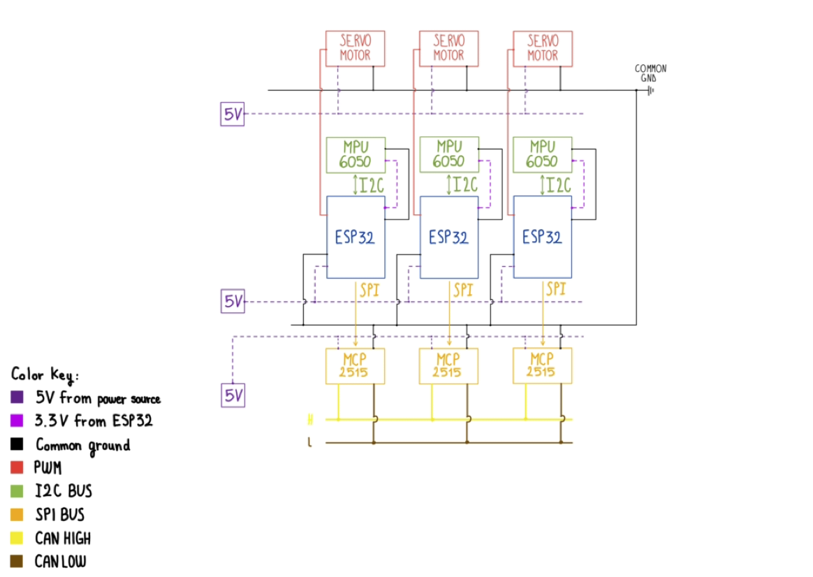

# Triple-Modular-Redundancy-TMR-
Triple Modular Redundancy algorithm - Median based voting logic.

*Design and Implementation of an End-to-End Triple Modular Redundancy (TMR) Control System for Safety-Critical Actuators* 

*AUTHOR: Fabrizio S. Diaconu* 

*CONTEXT: Research and development technical paper* 

*MONTH and YEAR: 08/2026* 

**1. INTRODUCTION** 

In almost every safety-critical framework, fault tolerance is the basis of a successful mission and vehicle integrity. This paper presents the design—hardware and software—of an End-to-End TMR control system. 

This structure mitigates hardware vulnerabilities preventing Single Points of Failure (SPoF), by replicating data acquisition, processing, and actuation. I made this possible by using three identical parallel nodes. Each one has one of these main components—MPU6050 accelerometer sensor; ESP32 microcontroller; MCP2515 CAN Bus Module; Servomotor. The nodes communicate with each other through the CAN bus shared network; the whole system executes a real-time majority voting algorithm to command three different servomotors. 

**2. HARDWARE ARCHITECTURE**

The prototype I built is made of three mirrored channels, each one with its own components. Here follows the functional block diagram I made of the framework: 

figure 1
 

**2.1 VOLTAGE and GROUND CHARACTERISTICS**  

As shown in the block diagram above, there are three different main power sources. This had to be done for specific reasons—The actuators generate high current spikes that create electromagnetic interferences along the power rails, potentially disrupting the communication lines of the CAN Modules, furthermore these spikes could exceed the maximum tolerance of the ESP32s microcontroller’s pins, leading to hardware degradation. 

Also, there is a shared ground reference; it was the best choice to avoid interaction issues between components which work at different voltages (such as the MPU6050 that requires a 3.3V voltage). Moreover, if hardware units are powered by different supplies, and don’t share a common ground reference, they cannot establish a baseline voltage for signaling and fail to exchange data; thus, making the whole prototype inoperative. 

**2.2 I2C BUS and MPU6050 SENSOR** 

In figure 1, a bidirectional arrow labeled “I2C” represents the specific communication bus that allows the ESP32 and the MPU6050 sensor to interact. This bus consists of two lines: SDA (Serial Data) and SCL (Serial Clock). As shown, each microcontroller has its own dedicated I2C bus and sensor. The system was designed this way to ensure fault tolerance; having three completely independent sub-systems guarantees strict fault isolation in case one of them fails. 

You may ask why I have decided to choose the MPU6050. The answer is quite simple-it offers a 3-axis accelerometer and gyroscope; while currently only the accelerometer is used, I could implement the gyroscope in future advancements of the prototype to ensure even better angle correction. Furthermore, it is cost-efficient and reliable. Its integrated Digital Motion Processor reduces the ESP32’s computational workload, and finally its open-source libraries are thoroughly tested and documented. 

**2.3 SPI BUS and MCP2515 CAN BUS MODULE** 

Now, let me introduce you to the communication network. I needed fast data exchange; this is the key to a fail-safe system. I chose the SPI protocol since it ensures exactly this. Why didn’t I use I2C? Because it is too slow to exchange and process data almost simultaneously. The modules need to calculate the correct inclination in real-time. Furthermore, the choice of the MCP2515 module wasn’t a blind one: I was looking for a reliable, interference-resistant bus, and this was the perfect match. To guarantee signal integrity and prevent reflections, the network is terminated with 120Ω resistors at the two outer modules. Thanks to its arbitration system, if two nodes send a message simultaneously, the data doesn’t deteriorate, as the module manages the messages through ID priority. Moreover, if irrelevant messages are on the line, it excludes them thanks to hardware filters, avoiding CPU overload. 

 

**3. SOFTWARE LOGIC and MAJORITY VOTING**  

**3.1 SYSTEM CONFIGURATION and FIRMWARE OPTIMISATION** 

When looking at the code, one immediately notices a series of #define directives that systematically map the pins and all critical constants. This approach was a winning strategy, allowing me to maintain the same code across every microcontroller—making it truly redundant in every sense of the word, while also optimizing RAM usage. 

**3.2 DATA SERIALIZATION and NON-BLOCKING ARCHITECTURE** 

Just before the setup() function, two union structures can be noticed. They are not placed there randomly; in fact, there is an important engineering thought behind them: CAN modules only accept data in bytes, while the sensors return a float. To avoid endianness problems, I chose to decompose the float value directly into bytes (hence the choice of using a union and the uint8_t variable type). 

Across the program you can see a bunch of time conditions, I chose to use non-blocking timers to avoid the introduction of the delay () function, which literally blocks the code and makes the system very slow. 

**3.3 SYSTEM OPERATION AND FAULT DETECTION** 

The system relies on four LEDs to communicate its status. The LED on ‘ONOFF_LED_PIN’ simply reflects whether the system itself is on or off, set by the ‘ledState’ variable. The LED on ‘CALIBRATION_LED_PIN’ turns on while the sensor is going through its initial calibration phase and turns off once ‘isCalibrated’ becomes true. The warning LED on each node's own 'MPU_WARNING_LED_PIN' (FIRST_MPU_WARNING_LED_PIN, SECOND_MPU_WARNING_LED_PIN, or THIRD_MPU_WARNING_LED_PIN, depending on the node) turns on whenever that specific node's own sensor stops responding, controlled by the ‘warningLed’ variable. Finally, the LED on ‘COMMUNICATION_WARNING_LED_PIN’ has two purposes: it turns on across the other nodes whenever one system is switched off, and it also turns on whenever a node's MCP2515 fails to communicate over the CAN bus, driven by the ‘communicationWarningLed’ variable. 

When entering the void loop(), the first variable you see is 'isCalibrated', which handles the initial calibration of the sensors—a necessary step before any reading can be trusted, during which the calibration LED stays on. Right after, there is the 'ledState' variable: it simply turns the whole system on or off. When the system is off, the respective servomotor stays at rest (90 degrees) and the communication warning LED lights up on the other two circuits. 

 

 

Once inside the ‘ledState’ condition, the code first checks whether its own sensor is responding. If it isn't, the node's own MPU warning LED turns on and the code attempts to re-establish the connection on its own. When the sensor is working, the ESP32 reads the inclination value directly from it and assigns it to its own readingValueTX field (firstCAN_data.readingValueTX, secondCAN_data.readingValueTX, or thirdCAN_data.readingValueTX, depending on the node); if the sensor isn't working, it assigns that field a value of 999.0f instead, so the rest of the system can recognize that reading as invalid. This value is then stored in an array that holds all three inclination readings. 

Each node sends its value over the CAN bus at its own scheduled time. If one or both of the other two CAN buses aren't responding, the communication warning LED turns on and the system attempts to re-establish contact with them as well. Once all three values have been collected into the array, a bubble sort algorithm sorts them in preparation for the voting logic. 

**3.4 VOTING LOGIC**

The voting logic handles three different scenarios, depending on how many sensors are actually working: 

1) If all three sensors are working, the algorithm takes the median of the three values. 

2) If only two sensors are working, the algorithm calculates the mean of the two working values and sends it across the system's network. 

3) If only one sensor is working, the system takes that single value as the reference, which is then used by all three servomotors. 

**4. OUTPUTS** 

I placed all the outputs at the very end of the code. This way, if I ever need to change something, I don't have to go through the whole program to find where the outputs are handled. 

**5. FUTURE ADJUSTMENTS** 

This prototype is a starting point, not a finished system. One limitation I'm already aware of is in the calibration logic: once a sensor has been calibrated, if it gets disconnected and later reconnected, the system doesn't calibrate it again automatically, which could lead to inaccurate readings after a reconnection. Beyond fixing this, a few concrete steps could push the project closer to real aerospace-grade fault tolerance: implementing the MPU6050's gyroscope alongside the accelerometer for more accurate angle correction, adding more rigorous automated testing instead of manual fault injection, and eventually testing the system on more realistic hardware setups closer to what a real aerospace application would require. 
